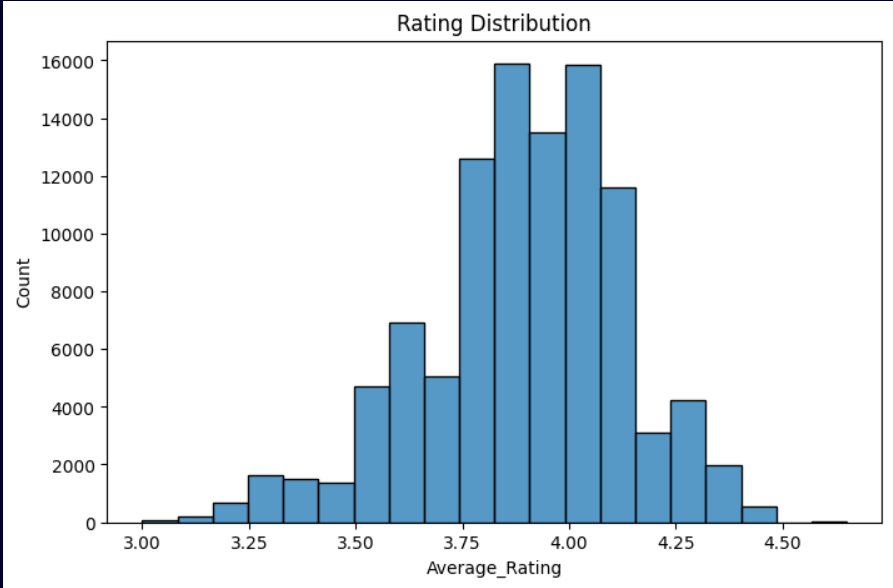

# Zomato Data Analysis

## Overview
This project performs exploratory data analysis on a Zomato restaurant dataset to understand trends in ratings, pricing, cuisines, and city distribution.

## Dataset
Source: Kaggle Zomato Dataset

## Tools Used
Python
Pandas
Matplotlib
Seaborn

## Analysis Performed
Data Cleaning
Exploratory Data Analysis (EDA)
Rating Distribution Analysis
City-wise Restaurant Distribution
Price vs Rating Analysis

## Visualizations

## Key Insights
Most restaurants have ratings between 3.5 and 4.5.
Some cities dominate the restaurant market.
Higher price restaurants slightly tend to have better ratings.

## Author
Deepak Adhikari
