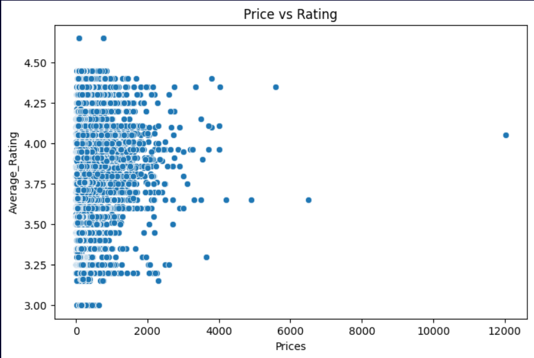

# Zomato Data Analysis

## 📌 Project Overview

This project performs **Exploratory Data Analysis (EDA)** on a Zomato restaurant dataset to understand trends in restaurant ratings, pricing, cuisines, and city distribution.
The analysis helps identify patterns such as popular cuisines, highly rated restaurants, and the relationship between pricing and ratings.

---

## 📊 Dataset

* Source: Kaggle Zomato Dataset
* The dataset contains information about restaurants including:

  * Restaurant Name
  * City
  * Cuisine
  * Ratings
  * Price
  * Dining Rating
  * Delivery Rating

---

## 🛠 Tools and Technologies Used

* Python
* Pandas
* NumPy
* Matplotlib
* Seaborn
* Google Colab

---

## 🔍 Steps Performed

### 1. Data Loading

The dataset was loaded using **Pandas** and initial exploration was performed.

### 2. Data Cleaning

* Removed duplicate records
* Handled missing values
* Standardized column names

### 3. Exploratory Data Analysis (EDA)

Performed multiple analyses such as:

* Restaurant distribution across cities
* Rating distribution
* Price vs Rating relationship
* Top cuisines analysis

### 4. Data Visualization

Various visualizations were created using **Matplotlib** and **Seaborn** to better understand trends in the dataset.

Examples of visualizations:

* Rating distribution
* Price vs Rating scatter plot
* City-wise restaurant distribution
* Top cuisines

---
## Visualization

---

## 📈 Key Insights

* Most restaurants have ratings between **3.5 and 4.5**.
* Certain cities have significantly more restaurants than others.
* Higher priced restaurants tend to have slightly better ratings.
* Some cuisines dominate the restaurant market.

---

## 📂 Project Structure

Zomato-Data-Analysis
│
├── data
│   └── enhanced_zomato_dataset_clean.csv
│
├── notebook
│   └── zomato_analysis.ipynb
│
├── images
│
└── README.md

---

## 🚀 Future Improvements

* Build an interactive dashboard using **Power BI or Tableau**
* Perform advanced statistical analysis
* Create machine learning models to predict restaurant ratings

---

## 👨‍💻 Author

Deepak Adhikari

---

## ⭐ If you found this project useful

Feel free to ⭐ star this repository.

